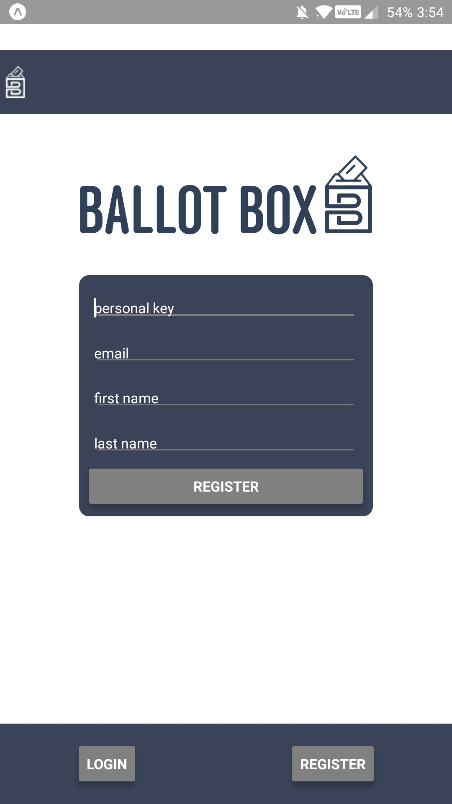
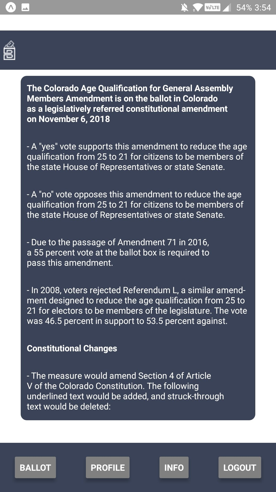
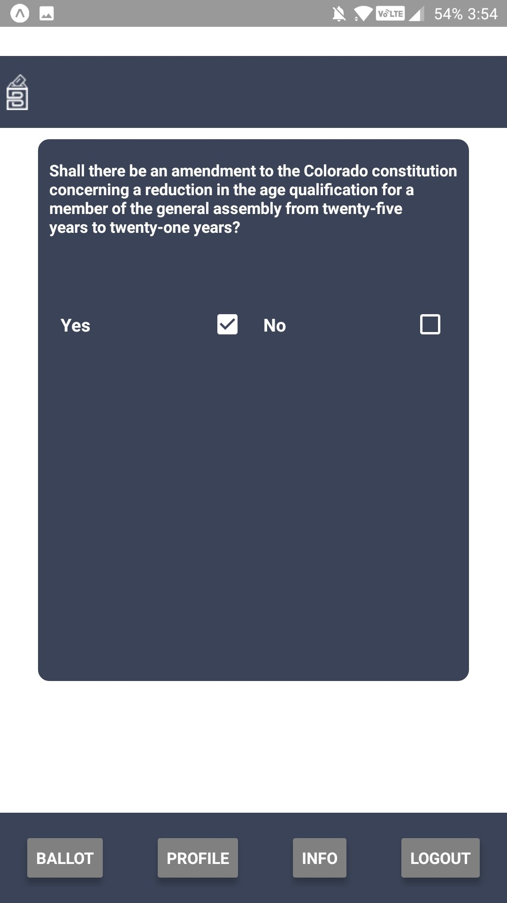

# Description
Ballot Box is a React Native App to show the potential of how a mobile application would improve civil participation in the general public. Most importantly, Ballot Box is aimed at increasing overall voter turnout in the United States to improve voter outcomes for all citizens.

Ballot Box approaches the problem by implementing an easy to use app where each voter has a centralized location for all their basic voting needs, including information about candidates, legislation, and issue that will be on the ballot, a place to cast their vote, and a place to track and edit their voter information.

From a security perspective, each voter will register their account with their vital information and a uniquely generated voter key that would be sent out by the government authority responsible for tracking voter information. In the future an app like this might include block-chain to help improve overall security.

# Screen Shots

# Installation
* fork
* git clone
* open the project with [Expo XDE](https://expo.io/tools#xde) (for instructions follow the link)

# To download and use the app on your own device
* download the Expo mobile app for either [iOS](https://itunes.apple.com/us/app/expo-client/id982107779?mt=8) or [Android](https://play.google.com/store/apps/details?id=host.exp.exponent&hl=en)
* open the Expo app and scan the QR code found [here](https://expo.io/@tyslas/ballotbox)
